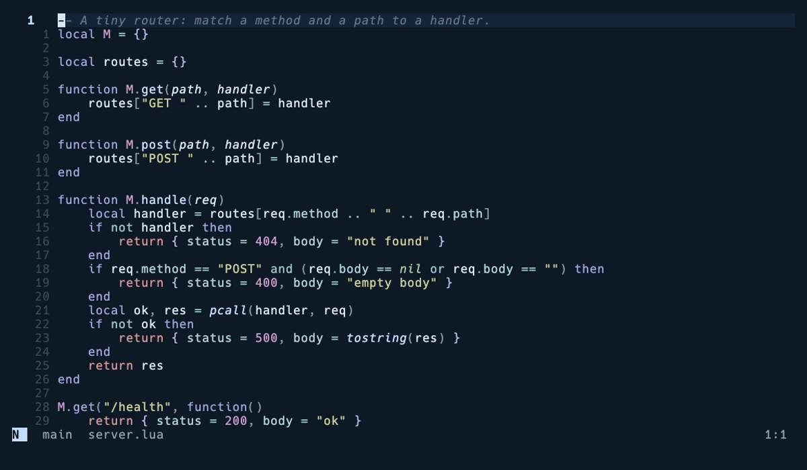

# glassterm.nvim

A floating terminal that is already running when you press the key.


Press <kbd>Alt</kbd>+<kbd>t</kbd> and a shell appears over your code in about
4 ms, because nothing starts. glassterm keeps the shell alive in a hidden
buffer and only shows or hides a window.

## Install

With [lazy.nvim](https://github.com/folke/lazy.nvim)

```lua
{ "skhan75/glassterm.nvim", lazy = false, opts = {} }
```

On macOS your terminal has to send Option as Alt. Ghostty wants
`macos-option-as-alt = left`, kitty wants `macos_option_as_alt left`, and
iTerm2 calls it "Esc+".

## Keys and commands

| Key or command | What it does |
|---|---|
| <kbd>Alt</kbd>+<kbd>t</kbd> | Show the terminal, or hide it if you are in it |
| <kbd>Alt</kbd>+<kbd>z</kbd> | Grow it to the full editor and back |
| `2`<kbd>Alt</kbd>+<kbd>t</kbd> | A second terminal |
| `:Glassterm style drop` | Switch shape |
| `:Glassterm send make test` | Run something, or send lines with `:'<,'>Glassterm send` |
| `:Glassterm rerun` | Run your last command again without opening the terminal |

Leave terminal mode the usual way with <kbd>Ctrl</kbd>+<kbd>\\</kbd>
<kbd>Ctrl</kbd>+<kbd>n</kbd>.

## Four shapes

Pick one in `opts`, or switch any time with `:Glassterm style drawer`.

| `glass` | `drop` |
|---|---|
|  |  |
| **`drawer`** | **`capsule`** |
|  |  |

## It knows your shell

The title follows `cd`. A failed command turns the border red. `:Glassterm
rerun` runs your last command again and tells you how it went, while you stay
in your code.



glassterm adds a small hook to the zsh, bash and fish shells it starts. Your
own shell files are never touched.

## Options

<details>
<summary>Defaults</summary>

```lua
require("glassterm").setup({
    style = "glass", -- "glass", "drop", "drawer" or "capsule"
    shell = nil, -- nil uses your 'shell'
    prewarm = { enabled = true, delay_ms = 1000 },
    hide_on_leave = true, -- hide it when you go back to your code
    close_on_exit = true,
    integration = { enabled = true, notify_on_failure = true },
    ui = { hints = true },
    keys = {
        toggle = "<M-t>",
        zoom = "<M-z>",
        send = false, -- try "<leader>ts"
        rerun = false, -- try "<leader>tr"
    },
    styles = { -- 1 or less is a fraction of the editor, more is cells
        glass = { width = 0.86, height = 0.80 },
        drop = { height = 0.42 },
        drawer = { width = 0.44, side = "right" },
        capsule = { width = 76, height = 12, row = 0.26 },
    },
})
```

</details>

Colors follow your theme. Everything links to the usual float groups, so
`GlasstermBorder` is `FloatBorder` unless you say otherwise. With a
transparent colorscheme the float is the same glass as your editor.

Run `:checkhealth glassterm` to see whether your shell is hooked up.

## Speed

About 4 ms per toggle on a bare setup, and about 8 ms with a full config, from
keypress to finished redraw. Starting a fresh zsh with oh-my-zsh takes around
1.9 s on the same machine, and that is the wait pre-starting removes. Measure
it yourself with `make bench`.

## How it is different

- toggleterm.nvim is the mature all rounder with splits, tabs and many
  terminals. glassterm keeps one terminal, starts its shell in advance and
  knows what your shell is doing.
- snacks.nvim has a terminal too and is a fine pick if you already run snacks.
  glassterm is standalone and gives you the four shapes and the shell hook.
- vim-floaterm covers Vim as well and has more window positions. glassterm is
  Neovim only and trades that for the instant toggle.

## Questions

**Alt and t does nothing on macOS.** Your terminal is sending Option as a
character. See the install notes above.

**My TermOpen autocommand runs startinsert. Does pre-starting throw my editor
into insert mode?** No. glassterm holds TermOpen back until the float first
opens, then runs it there.

**Alt and t inside another terminal buffer toggles glassterm.** That is on
purpose, one key everywhere. Change `keys.toggle` if you want Alt and t inside
terminals.

## Development

`make test` runs the tests. `make bench` measures the toggle. `make demo`
records these GIFs with [VHS](https://github.com/charmbracelet/vhs).

## License

MIT
